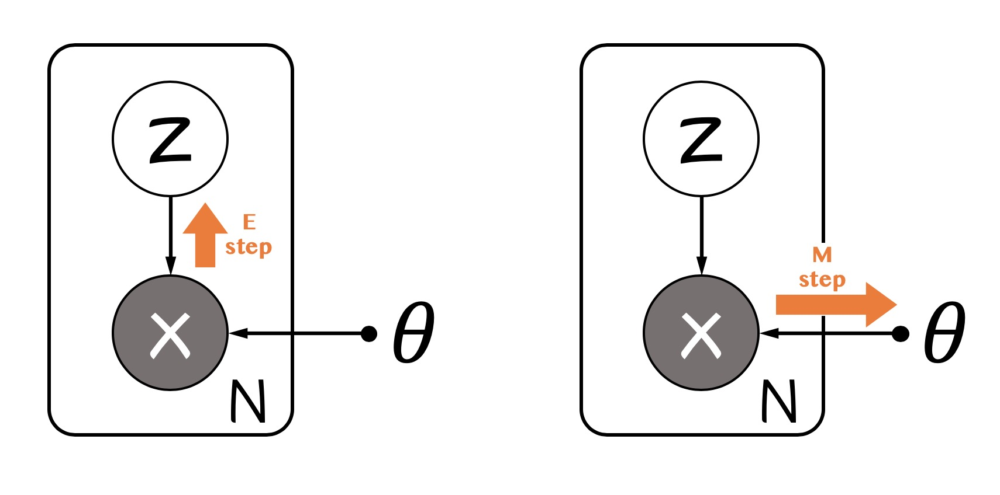
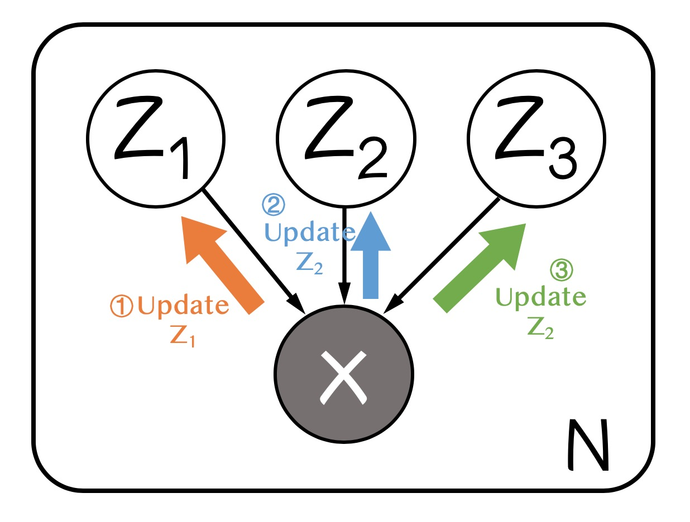
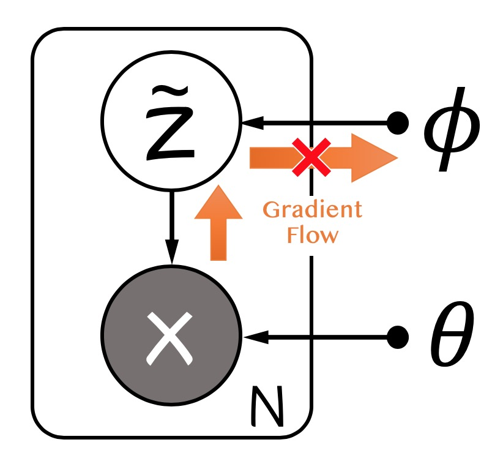
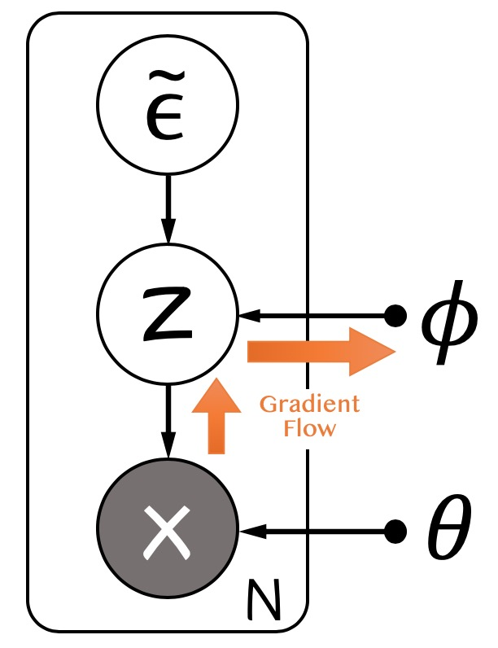
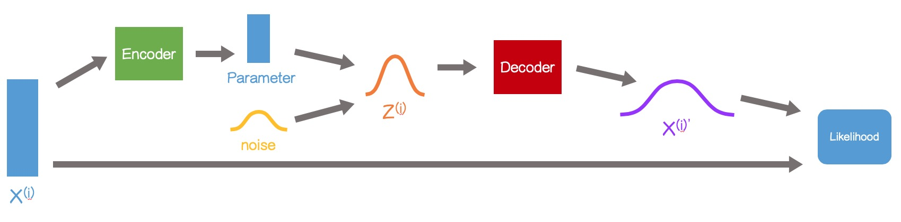

# 隐变量，EM算法，变分EM，VAE

最大似然框架下，假设观测变量有缺失或不可观测的属性时，要用到变分的方法。隐变量模型往往是无监督或者少监督模型，因为监督信息可以看做是包含在缺失的隐变量中的一部分。

注意：

1. 缺失观测和样本一一对应，而参数则是所有样本共享的。
2. 似然下界的输入是参数和变分分布，梯度回带到参数和分布上。
3. 不可处理（intractable）的分布定义为无法计算，且无法求导。

假设输入$(x, z)\in\mathcal{D}=\mathcal{X}\times\mathcal{Z}$中$\mathcal{Z}$空间是无法观测到的，那么我们的目标就变为了最大化对数边缘似然

$$
\tag{1}
\max_{\theta\in\Theta}\log\mathcal{L}(\theta;\mathbf{X})=\sum_{x\in\mathbf{X}}\log p_\theta(x)=\sum_{x\in\mathbf{X}}\log\sum_{z\in\mathcal{Z}}p_{\theta}(x, z),
$$

其中$\mathbf{X}\subset\mathcal{X}$是观测到的数据集。

## EM算法

直接在式子$(1)$中对$\theta$求导是不好计算的，因为$\log$中有求和。EM算法的思路是优化$(1)$的下界，**其核心假设是$p_\theta(x, z)$是很好处理的**。利用$\log$函数的凹性和Jensen不等式：

$$
\tag{2}
\log\sum_{z\in\mathcal{Z}}p_{\theta}(x, z) = \log\sum_{z\in\mathcal{Z}}\frac{p_{\theta}(x, z)}{q(z)}q(z) \geq \sum_{z\in\mathcal{Z}}q(z)\left\{\log p_\theta(x, z)-\log q(z)\right\},
$$

其中$q(z)$是任意定义在$\mathcal{Z}$上的概率密度函数，且$\forall z \in \mathcal{Z} q(z) > 0$。因此之后优化下界

$$
\max_\theta\hat{\mathcal{L}}(q, \theta;\mathbf{X})=\sum_{x\in\mathcal{X}}\sum_{z\in\mathcal{Z}}q(z)\left\{\log p_\theta(x, z)-\log q(z)\right\}.
$$

这个下界是一个双变量的泛函，一个变量是概率密度$q$，一个变量是参数$\theta$。采用坐标梯度法，交替寻找当前最优的$q$和$\theta$即为EM算法。对$q$取最大要求$(2)$式中等号成立，即要求$\forall z \in \mathcal{Z}, p_\theta(x, z)/q(z)=C$，$C$为某一常数，简单计算一下能得到$C = p_\theta(x|z)$，而

$$
\tag{E step}
q^\star(z)=p_{\theta}(z|x)
$$

而我们在M步时往往会遇到$\sum_zq(z)\cdot z$这样的$z$的期望形式，因此在实际实现中，我们往往在内存里记录隐变量的期望

$$
\tag{E step in practice}
\mathbb{E}[z] = \sum_{z\in\mathcal{Z}}p_\theta(z|x)\cdot z
$$

这也是E步名字的由来。M步得名原因是我们在这一步里对$\theta$求了最大，注意这个下界往往是凹的（大部分模型是对数凹的，比如GMM中的高斯分布等指数族分布），因此更新的方式为

$$
\tag{M step}
\theta^{new} = \arg\max_\theta\sum_{z\in\mathcal{Z}}p_{\theta^{old}}(z|x)\log p_\theta(x, z)
$$

表示成概率图是这样：

    

## 变分EM

变分EM是为了处理全贝叶斯情形下对参数、隐变量的多重积分不可求的问题而发明的。变分（variational）意味着我们要近似一个函数，在一族函数中找一个最能近似目标的。EM算法中的$q(z)$即为一个变分分布，用以近似真实的隐变量后验分布$p_\theta(z|x)$，而变分EM甚至需要对$q(z)$做进一步的近似。

EM算法假设我们有参数$\theta$和隐变量$z$要估计。特别地，对于参数$\theta$我们做的是点估计，是最大似然或者最大后验推断。但是在全贝叶斯方法中，我们对$\theta$也会引入先验分布$p(\theta|\alpha)$，并积分掉$\theta$（$\alpha$是超参）。也即现在我们的目标是

$$
\max_\alpha \int p(x|\theta)p(\theta|\alpha) d\theta=\int\int p(x, z|\theta)p(\theta|\alpha)d\theta dz
$$

我们可以把$\theta$吸收到$z$中，形式上其实和$(2)$一致。即便我们用一个变分分布$q(z, \theta)$来近似$p_\alpha(z, \theta|x)$，在EM算法中往往也会涉及到intractable的积分。一个思路是采样这样的积分，用MCMC方法的思路，这样做的缺点是对每个样本都要做一次采样，对于大数据集计算开销相当大。另一种方法是解耦合这样可以分组的隐变量。

我们假设$q(z, \theta) = q(z)q(\theta)$，或者更一般地，假设$q(z) = \prod_i q_i(z_i)$，即每组隐变量有自己的变分分布且相互独立。假设这样分解以后，对于每个隐变量组$q_i(z_i)$都是tractable的，记$q_i=q_i(z_i)$，单独提取出$z_j$观察下界$\hat{\mathcal{L}}$有

$$
\begin{align}
\hat{\mathcal{L}(q)} &= \int \prod_i q_i \left\{\log p(x, z)-\sum_i\log q_i\right\}dz \\
&=\int \prod_i q_i\log p(x, z)dz-\int\prod_iq_i\sum_{i'}\log q_{i'} dz \\
&=\int q_j\left\{\int\log p(x, z)\prod_{i\neq j}q_i dz_i \right\}dz_j - \int \prod_{i} q_i\log q_jdz + \int \prod_i q_i\sum_{i'\neq j}\log q_{i'} dz\\
&= \int q_j \mathbb{E}_{i\neq j}[\log p(x, z)]dz_j - \int q_j\log q_jdz_j + const
\end{align}
$$

把右侧看做一个KL散度，最优的$q_j$满足

$$
\tag{Variational EM}
\log q_j^\star(z_j) = \mathbb{E}_{i\neq j}[\log p(x, z)]
$$

注意到更新$z_j$的分布需要用到$i\neq j$的所有分布来算$p(x, z)$，因此不同的隐变量组的更新是相互依赖的。变分EM迭代地固定$i\neq j$来更新某个隐变量$z_j$，直至所有的隐变量组分布收敛。概率图如下：

    

## VAE

变分自编码器（Variational Auto Encoder）也是隐变量的intractability带来的，不同之处是VAE进一步假设，$p_\theta(x, z), p_{\theta}(z|x)$都是intractable的，且变分将$z$分组也不能使得分布变为tractable的，这样的情形是存在的，比如非线性神经网络。因此我们需要更好的变分方式来近似$p_\theta(z|x)$。VAE提出的方案是用一个由$\phi$控制的分布$q_\phi(z|x)$：

$$
\begin{align}
\tag{3}
\hat{\mathcal{L}} (\theta, \phi; \mathbf{X}) &= \sum_{x\in\mathcal{X}}\mathbb{E}_{q_\phi(z|x)}[\log p_\theta(x, z)-\log q_\phi(z|x)]\\
&= \sum_{x\in\mathcal{X}}\sum_{z\in\mathcal{Z}}q_\phi(z|x)\left\{\log p_\theta(x|z)+\log p_\theta(z)-\log q_\phi(z|x)\right\} \\
\tag{5}
& = \sum_{x\in\mathcal{X}}\mathbb{E}_{q_\phi(z|x)}[\log p_\theta(x|z)] - \text{KL}\left[q_\phi(z|x)\Vert p_\theta(z)\right]
\end{align}
$$

其中$q_\phi(z|x)$被理解为编码器（Encoder），将观测样本映射到隐变量空间$\mathcal{Z}$，$p_\theta(x|z)$为解码器，将隐变量映射回观测样本空间$\mathcal{X}$。

我们要优化$\hat{\mathcal{L}}$需要对$\theta$和$\phi$求导，其中对$\phi$求导因为期望的存在有几种处理方式。这里看到$\hat{\mathcal{L}}$有$(3)$和$(5)$两种表示，其对$\phi$求导有些问题。

### Monte Carlo gradient estimator

一般期望对于分布的参数求导可以使用下面的近似

$$
\begin{align}
\nabla_\phi\mathbb{E}_{q_\phi(z)}[f(z)] &= \int f(z) \nabla_\phi q_\phi(z) dz \\
&=\int f(z) q_\phi(z) \frac{\nabla_\phi q_\phi(z)}{q_\phi(z)} dz\\
&=\int f(z)q_\phi(z)\nabla_\phi\log q_\phi(z) dz\\
&=\mathbb{E}_{q_\phi(z)}[f(z)\nabla_\phi\log q_\phi(z)] \\
&\simeq \frac{1}{L}\sum_{l=1}^{L}f(z^{(l)})\nabla_\phi\log q_\phi(z^{(l)})
\end{align}
$$

但是这样得到的近似方差很大，需要较大的$L$来保证一个很好的梯度估计（详见[这篇文章](https://icml.cc/2012/papers/687.pdf)）。在$(3)$中我们可以用类似的方式得到$\hat{\mathcal{L}}$对$\phi$的导数，但是较大的$L$使得每个样本的采样代价高，因此在大数据集上没有办法应用。

### Reparameterization trick (SGVB estimator)

对于式$(3)$中的期望，如果我们对$z$节点进行采样近似以后，再算对$\phi$的导数会得到不正确的结果，因为采样的分布$q_\phi(z|x)$是依赖$\phi$的，概率图如下：

    

Reparameterization将随机性的来源从$z$转移到另一个辅助的噪声变量$\epsilon$，假设$z=g_\phi(\epsilon, x)$，其中$\epsilon\sim p(\epsilon)$，$(3)$式变为

$$
\begin{align}
\hat{\mathcal{L}}{}^A(\phi, \theta;\mathbf{X}) &= \sum_{x\in\mathcal{X}}\mathbb{E}_{q_\phi(z|x)}[\log p_\theta(x, z)-\log q_\phi(z|x)] \\
&=\sum_{x\in\mathcal{X}}\mathbb{E}_{p(\epsilon)}[\log p_\theta(x, g_\phi(\epsilon, x))-\log q_\phi(g_\phi(\epsilon, x)|x)]\\
&\simeq \sum_{x\in\mathcal{X}}\frac{1}{L}\log p_\theta(x, g_\phi(\epsilon^{(l)}, x))-\log q_\phi(g_\phi(\epsilon^{(l)}, x)|x)
\end{align}
$$

这样的近似比MC梯度近似有更小的方差，且我们可以直接对损失函数进行近似。SGVB的概率图如下：

    

### Second Version SGVB estimator

$(3)$式可以化简为$(5)$式，若$(5)$式中的KL散度项可以积分（tractable），我们就可以只对$(5)$式中的第一项进行采样近似，相比于最原始的SGVB估计子，因为只对变分下界$\hat{\mathcal{L}}$的一部分近似，方差会更小：

$$
\hat{\mathcal{L}}{}^B(\phi, \theta; \mathbf{X}) = -\text{KL}\left[q_\phi(z|x)\Vert p_\theta(z)\right] + \frac{1}{L}\sum_{l=1}^L\log p_\theta\left(x\middle|g_\phi(\epsilon^{(l)}, x)\right)
$$

最后，整个VAE的过程如下：

    

